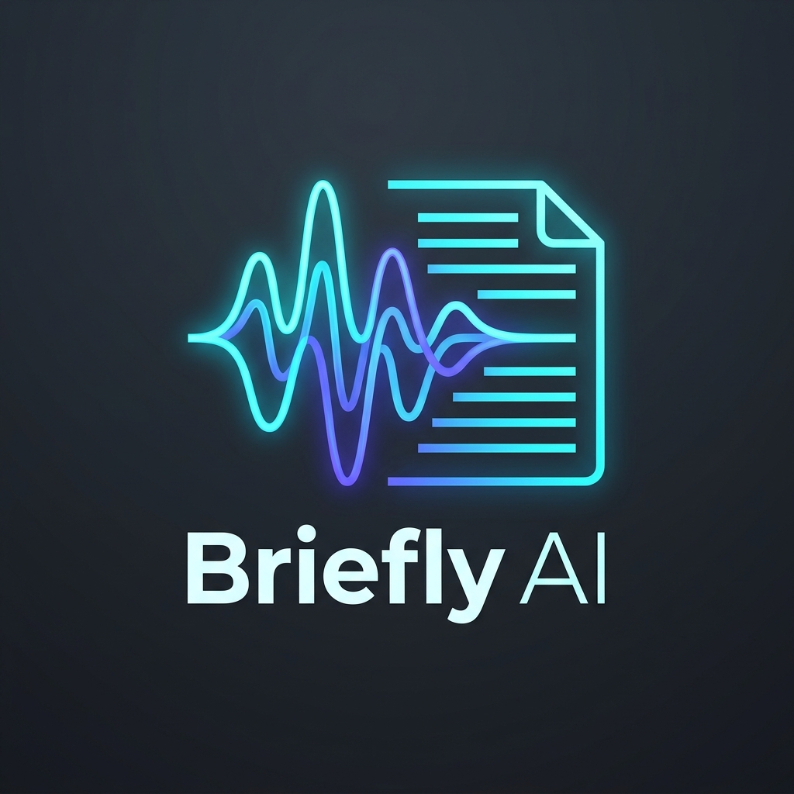
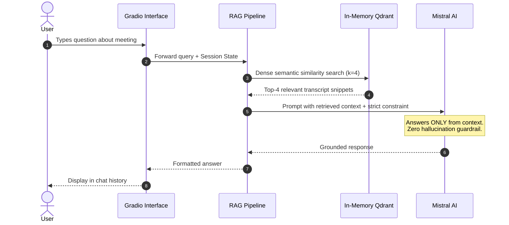

<div align="center">



<h2> intelligent multimodal meeting synthesis & transcript rag </h2>

[](https://huggingface.co/spaces/Sarashehreen/Briefly-AI)
[](https://www.python.org/)
[](https://mistral.ai/)
[](https://github.com/openai/whisper)
[](https://qdrant.tech/)
[](https://opensource.org/licenses/MIT)

<p align="center">
  <b>Turn hours of video and audio into structured executive summaries, action items, and conversational transcript knowledge with zero hallucinations.</b>
</p>

[**Explore the Live Demo on Hugging Face Spaces →**](https://huggingface.co/spaces/Sarashehreen/Briefly-AI)

</div>

---

## Navigation
- [<code>Live Demo</code>](#live-demo)
- [<code>Overview</code>](#overview)
- [<code>System Architecture</code>](#system-architecture)
- [<code>RAG Retrieval Pipeline</code>](#rag-retrieval-pipeline)
- [<code>Core Capabilities</code>](#core-capabilities)
- [<code>Tech Stack</code>](#tech-stack)
- [<code>Engineering Highlights</code>](#engineering-highlights)
- [<code>Quickstart & Setup</code>](#quickstart--setup)
- [<code>Repository Structure</code>](#repository-structure)
- [<code>License</code>](#license)

---

## Live Demo
$${\color{#6C5CE7}Cloud \space \color{#8E8E93}Deployment}$$

Experience **Briefly AI** live in your browser:
**[https://huggingface.co/spaces/Sarashehreen/Briefly-AI](https://huggingface.co/spaces/Sarashehreen/Briefly-AI)**

*Hosted on Hugging Face Spaces with dynamic ZeroGPU acceleration.*

---

## Overview
$${\color{#6C5CE7}Problem \space \color{#8E8E93}\& \space \color{#6C5CE7}Solution}$$

Modern teams spend countless hours in meetings, resulting in lost action items, buried decisions, and unsearchable video recordings. 

**Briefly AI** solves this with an end-to-end multimodal pipeline:
1. **Ingest**: Accepts YouTube URLs or local audio/video files (`.mp4`, `.mp3`, `.wav`, `.m4a`).
2. **Transcribe**: Dual speech-to-text routing with **OpenAI Whisper** (English) and **Sarvam AI** (Hinglish / Indic dialects).
3. **Synthesize**: Multi-stage **Mistral AI** extraction chains produce executive summaries, task items with assignees/deadlines, key decisions, and open questions.
4. **Converse**: Transcript chunks are vectorized with `all-MiniLM-L6-v2` into an in-memory **Qdrant Vector Store** for context-grounded conversational Q&A.

---

## System Architecture
$${\color{#00CEC9}End-to-End \space \color{#8E8E93}Pipeline}$$

```mermaid
flowchart TD
    %% Input Layer
    A([User Input: YouTube URL or Local File]) --> B[Audio Acquisition & Preprocessing]
    
    %% Audio Processing Subsystem
    subgraph Audio Processing
        B -->|yt-dlp / pydub| C[FFmpeg 16kHz Mono WAV Extraction]
        C --> D[10-Minute Chunking Engine]
    end

    %% Transcription Routing Subsystem
    subgraph Hybrid Speech-to-Text Routing
        D --> E{Language Selection}
        E -->|English| F[OpenAI Whisper ASR<br/>ZeroGPU Accelerated]
        E -->|Hinglish / Indic| G[Sarvam AI STT-Translate API<br/>25s Sliced Sync Pipeline]
        F --> H[Unified Full Transcript]
        G --> H
    end

    %% Intelligence Synthesis Subsystem
    subgraph LLM Synthesis Engine - Mistral AI
        H --> I1[Title Generator<br/>ChatMistralAI]
        H --> I2[Map-Reduce Summarizer<br/>Chunk Size: 3000 / Overlap: 200]
        H --> I3[Structured Action Items Extractor<br/>Task + Assignee + Deadline]
        H --> I4[Key Decisions Extractor]
        H --> I5[Open Questions Extractor]
    end

    %% Vector RAG Subsystem
    subgraph In-Memory RAG Knowledge Base
        H --> J[Recursive Character Text Splitter<br/>Chunk: 500 / Overlap: 50]
        J --> K[HuggingFace Embeddings<br/>all-MiniLM-L6-v2]
        K --> L[(In-Memory Qdrant Vector Store)]
    end

    %% Presentation Layer
    subgraph Interactive UI
        I1 --> M[Tabbed Intelligence Dashboard<br/>Summary | Actions | Decisions | Questions | Transcript]
        I2 --> M
        I3 --> M
        I4 --> M
        I5 --> M
        
        N[User Query] --> O[Dense Semantic Retriever<br/>k=4 Top Chunks]
        L --> O
        O --> P[Context-Constrained Mistral QA Chain]
        P --> Q[Grounded Answer Response]
    end
```

---

## RAG Retrieval Pipeline
$${\color{#FD79A8}Zero-Hallucination \space \color{#8E8E93}Q\&A}$$



---

## Core Capabilities

| Capability | Technical Mechanism | Output |
| :--- | :--- | :--- |
| **Multimodal Ingestion** | `yt-dlp` stream extraction + `pydub` audio conversion | 16kHz mono WAV format |
| **Dual-Engine STT** | OpenAI Whisper (`small`) + Sarvam AI (`saaras:v2.5`) | Timestamped raw text transcript |
| **Map-Reduce Synthesis** | LangChain LCEL map-reduce chain with Mistral AI | Structured executive bullet points |
| **Action Item Mining** | Zero-shot structured extraction prompts | Task description, owner, deadline |
| **Decision & Question Tracking** | Semantic role-labeling via Mistral AI | Numbered decisions & open topics |
| **Transcript Q&A Engine** | Dense embeddings (`all-MiniLM-L6-v2`) + Qdrant similarity search | Instant context-grounded answers |

---

## Tech Stack

<div align="center">

| Layer | Technologies |
| :--- | :--- |
| **Frontend & UI** | [Gradio 5](https://gradio.app/) |
| **LLM & Orchestration** | [LangChain LCEL](https://python.langchain.com/), [Mistral AI](https://mistral.ai/) (`mistral-small-latest`) |
| **Speech-to-Text** | [OpenAI Whisper](https://github.com/openai/whisper), [Sarvam AI](https://www.sarvam.ai/) |
| **Vector DB & Search** | [Qdrant](https://qdrant.tech/) (`langchain-qdrant`, in-memory mode) |
| **Dense Embeddings** | [Hugging Face](https://huggingface.co/) (`sentence-transformers/all-MiniLM-L6-v2`) |
| **Audio Processing** | `FFmpeg`, `pydub`, `yt-dlp` |
| **Deployment** | [Hugging Face Spaces](https://huggingface.co/spaces) (ZeroGPU / Docker) |

</div>

---

## Engineering Highlights
$${\color{#0984E3}Production \space \color{#8E8E93}Design}$$

- **ZeroGPU Acceleration**: Integrated `@spaces.GPU` decorators to dynamically allocate Nvidia A100 GPU compute during Whisper inference, speeding up audio transcription by ~10x over CPU execution.
- **In-Memory Vector Isolation**: Replaced persistent disk paths with transient in-memory Qdrant stores (`location=":memory:"`), eliminating SQLite lock contentions during multi-user web traffic.
- **Session State Decoupling**: Utilizes `gr.State()` to isolate video contexts, transcripts, and chat histories across concurrent visitors.
- **Audio Chunking Engine**: Slices long audio recordings into 10-minute master chunks and 25-second API sub-chunks to adhere to synchronous STT constraints.

---

## Quickstart & Setup
$${\color{#00B894}Local \space \color{#8E8E93}Installation}$$

### 1. Prerequisites
- Python 3.10+
- `ffmpeg` binary installed:
  ```bash
  # macOS
  brew install ffmpeg

  # Ubuntu / Debian
  sudo apt install ffmpeg

  # Windows (PowerShell)
  winget install Gyan.FFmpeg
  ```

### 2. Clone & Install
```bash
# Clone the repository
git clone https://github.com/shehreenmansoori/Briefly-AI.git
cd Briefly-AI

# Create virtual environment
python -m venv venv
source venv/bin/activate  # Windows: venv\Scripts\activate

# Install requirements
pip install -r requirements.txt
```

### 3. Configure API Keys
Create a `.env` file in the root folder:
```env
MISTRAL_API_KEY=your_mistral_api_key_here
SARVAM_API_KEY=your_sarvam_api_key_here
WHISPER_MODEL=small
```

### 4. Launch
```bash
python app.py
```
Open [http://127.0.0.1:7860](http://127.0.0.1:7860) in your browser.

---

## Repository Structure
$${\color{#6C5CE7}Codebase \space \color{#8E8E93}Layout}$$

```text
├── assets/
│   └── logo.png            # High-resolution vector project branding
├── core/
│   ├── __init__.py         # Package namespace initializer
│   ├── audio_processor.py  # Audio acquisition, format conversion & chunking
│   ├── extractor.py        # LCEL chains for actions, decisions & questions
│   ├── rag_engine.py       # LangChain LCEL RAG retriever & context QA chain
│   ├── summarize.py        # Map-Reduce summarization & title generation
│   ├── transcriber.py      # Dual STT engine (OpenAI Whisper + Sarvam AI)
│   └── vector_store.py     # Qdrant in-memory vector store & embedding setup
├── app.py                  # Gradio application entrypoint & session controller
├── packages.txt            # Linux container system dependencies (ffmpeg)
├── requirements.txt        # Python dependency manifest
├── README.md               # Architecture documentation & quickstart
├── .env.example            # Environment variable template
└── .gitignore              # Git ignore rules for keys and temporary media
```

---

## License

This project is licensed under the [MIT License](LICENSE).
