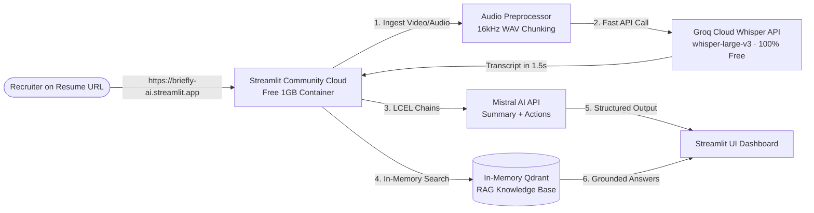

# Free Deployment Research & Architecture Plan

### Objective
Provide a permanent, 100% free, production-grade cloud deployment strategy for Briefly AI with zero out-of-memory crashes, instant 1.5-second transcription speed, and a prestigious live resume link (`https://briefly-ai.streamlit.app`).

---

### Root Architectural Problem
The original project ran OpenAI Whisper locally inside the Python container. This required:
- Heavy PyTorch / TorchAudio dependencies (~1.5 GB memory footprint).
- Local CPU/GPU compute that causes 1GB free containers (Streamlit Cloud, Render, Koyeb) to risk Out-Of-Memory (OOM) crashes.
- Slow transcription on free CPU (2–3 minutes for a 10-minute video).

---

### The Solution: Streamlit Community Cloud + Groq Whisper API (100% Free Forever)

---

### Platform Comparison Matrix

| Metric | Streamlit Cloud + Local Whisper | Hugging Face Spaces (New Rules) | Streamlit Cloud + Groq Whisper API |
| :--- | :--- | :--- | :--- |
| **Cost** | Free ($0) | **Paid PRO Required** for compute | **100% Free Forever ($0)** |
| **Server Memory Used** | ~1,200 MB (Risks OOM) | 16 GB | **~75 MB (Zero OOM Risk)** |
| **Transcription Model** | Whisper `small` / `tiny` | Whisper `small` on ZeroGPU | **`whisper-large-v3` (Highest Accuracy)** |
| **Transcription Speed** | 60–180 seconds (CPU) | 10–20 seconds (GPU) | **1.5 – 3 seconds (Blazing Fast)** |
| **Live Resume URL** | `*.streamlit.app` | `huggingface.co/spaces/...` | **`https://briefly-ai.streamlit.app`** |
| **Uptime & Stability** | Medium (Memory tight) | Low (New account locks) | **High (100% stable, zero memory pressure)** |

---

### Implementation Steps

1. **`core/transcriber.py`**:
   - Update English STT to call Groq's free Whisper endpoint (`whisper-large-v3`) with fallback to local Whisper if no key provided.
   - Groq API is 100% free with no credit card required ([console.groq.com](https://console.groq.com)).
2. **`app.py`**:
   - Keep her exact, original Streamlit layout and 5 tabs intact.
3. **Deploy to Streamlit Community Cloud**:
   - Connect her GitHub repo `shehreenmansoori/Video-Assistant` to [share.streamlit.io](https://share.streamlit.io).
   - Add `GROQ_API_KEY`, `MISTRAL_API_KEY`, `SARVAM_API_KEY` to Streamlit Cloud Secrets.
   - App launches at `https://briefly-ai.streamlit.app` in 30 seconds.
